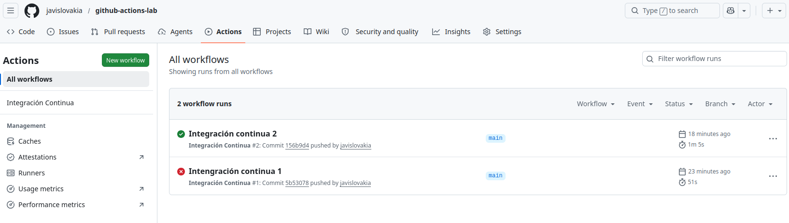
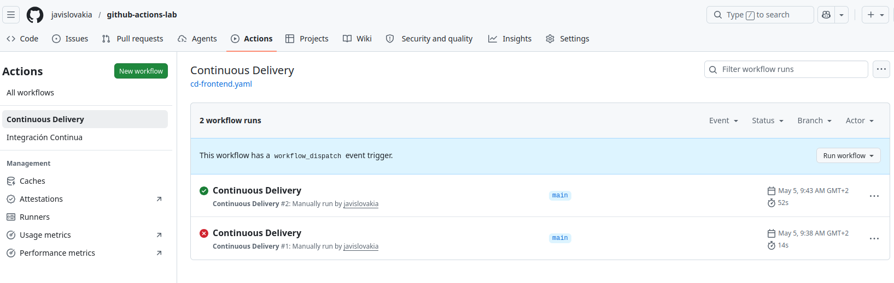
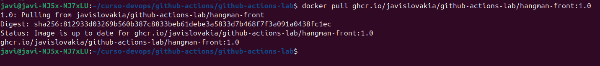

# 1. Workflow CI para el proyecto de frontend
Vamos a crear un workflow en Github para el proyecto hangman-front donde usamos la integración continua para automatizar el *build* y los test unitarios del proyecto cuando hay cambios (push o pull requests) en la rama *main*, y en concreto en la carpeta *hangman-front*.

Para ello, creo el siguiente archivo y carpetas en la carpeta raiz del proyecto: **.github/workflows/ci-frontend.yaml**

Y añado el siguiente contenido:

```yaml
name: Integración Continua

on:
  push:
    branch: [ main ]
    paths: [ 'hangman-front/**']
  pull_request:
    branches: [ main ]
    paths: [ 'hangman-front/**']

jobs:
  build:
    runs-on: ubuntu-latest

    steps:
      - name: Checkout
        uses: actions/checkout@v6
      - name: Set up Node.js version
        uses: actions/setup-node@v6
        with:
          node-version: 18
      - name: Build
        working-directory: ./hangman-front
        run: |
          npm ci
          npm run build
  
  test:
    runs-on: ubuntu-latest
    needs: build

    steps:
      - name: Checkout
        uses: actions/checkout@v6
      - name: Set up Node.js version
        uses: actions/setup-node@v6
        with:
          node-version: 18
      - name: Unit tests
        working-directory: ./hangman-front
        run: |
          npm ci
          npm run test
```

El fichero yaml especifica cuándo debe ejecutarse el workflow en la sección *on:*, y que acciones va a hacer en la sección *jobs:*

Usamos *actions* de Github para llevar el código del proyecto a la máquina virtual donde se ejecuten el build y los tests. De la forma en la que están configurados, se ejecutará primero el build, y si tiene éxito, se lanzará el test.

Ahora, para probarlo, simplemente hay que hacer un commit y un push a github. Para que funcione hay que hacer algún cambio en alguno de los ficheros que están dentro de la carpeta *hangman-front*, si no hacemos esto no se cumplirán las condiciones para que se lance el workflow. Esto lo hemos especificado con *path:* dentro del fichero yaml.

En la primera ejecución del workflow me ha fallado el job test. Mirando los logs dentro del workflow veo el siguiente error:

```
FAIL src/components/start-game.spec.tsx
  StartGame component specs
    ✕ should display a list of topics (69 ms)

  ● StartGame component specs › should display a list of topics

    expect(received).toHaveLength(expected)

    Expected length: 1
    Received length: 2
    Received array:  [<li>topic A</li>, <li>topic B</li>]
```

Para intentar solucionarlo cambio la línea 16 del archivo */hangman.front/src/components/start-game.spec-tsx* por la siguiente:

```typescript
expect(items).toHaveLength(2);
```

Simplemente aumento la longitud experada de 1 a 2.

Después de este cambio hago el push otra vez y esta vez el workflow se ejecuta correctamente.




# 2. Workflow CD para el proyecto de frontend
En este caso voy a crear un workflow de Continuous delivery que va a crear una imagen de Docker a partir del Dockerfile de la carpeta ./hangman-front, y además va a publicar dicha imagen en el Github Container Registry (ghcr.io).

Creo el siguiente archivo: **.github/workflows/cd-frontend.yaml**, con el contenido:

```yaml
name: Continuous Delivery

on:
  workflow_dispatch:

jobs:
  delivery:
    runs-on: ubuntu-latest
    permissions:
      contents: read
      packages: write

    steps:
      - name: Checkout
        uses: actions/checkout@v6
      - name: Login al Docker Registry
        uses: docker/login-action@v4
        with:
          registry: ghcr.io
          username: ${{ github.actor }}
          password: ${{ secrets.GITHUB_TOKEN }}
      - name: Build and Push Docker image
        uses: docker/build-push-action@v5
        with:
          context: ./hangman-front
          file: ./hangman-front/Dockerfile
          push: true
          tags: ghcr.io/${{ github.repository }}/hangman-front:1.0
```

La palabra reservada *workflow_dispatch* es la que le dice al workflow que se ejecute de forma manual, es decir, en la pestaña de Actions del proyecto de Github debemos de forma proactiva darle al botón para lanzar el workflow.

Algunos de los pasos (steps) del *job* son iguales que en el workflow de CI, como el checkout para llevar el código de la aplicación a la máquina virtual de Github donde se ejecutarán las acciones del workflow. Usamos otra *action* de Github para autenticarnos a ghcr.io, y otra para crear la imagen de docker y subirla a ghcr.io.

Una vez hecho eso, cuando hagamos un push para que el nuevo workflow esté en el repositorio de Github, vermos en la pestaña *Actions* la opción de ejecutar el CD workflow. En la siguiente imagen se puede ver. También se ven la correcta ejecución del workflow. Y una incorrecta porque se me olvidó ponerle el *tags* para la imagen en el archivo yaml.



Para usar dicha imagen se puede simplemente hacer un *docker pull*, *docker run*, etc. como con cualquier otra imagen de docker.



# 3. Workflow para ejecutar tests E2E 
Para ejecutar los End-to-End (E2E) tests voy a usar una combinación de Docker Compose y de Cypress Action. El primero para levantar la app y el segundo para ejecutar las pruebas.

Para preparar el uso de Docker Compose, creo el archivo *docker-compose.yaml* en la carpeta hangman-front con el siguiente contenido:

```yaml
services:
  hangman-app:
    build:
      context: .
      dockerfile: Dockerfile
    container_name: hangman-front-container
    image: javislovakia/hangman-front:local
    ports:
      - "8080:8080"
```

Como siempre que hacemos workflows, creo el archivo yaml en la carpeta donde Github los buscará: **.github/workflows/e2e-frontend.yaml**. Y el contenido es:

```yaml
name: Frontend E2E Tests

on:
  workflow_dispatch:
  pull_request:
    paths:
      - 'hangman-e2e/**'

jobs:
  e2e-run:
    runs-on: ubuntu-latest
    steps:
      - name: Checkout del código
        uses: actions/checkout@v6

      - name: Lanzamos la aplicación con Docker Compose
        run: docker compose up -d
        working-directory: ./hangman-front

      - name: Cypress run
        uses: cypress-io/github-action@v6
        with:
          working-directory: ./hangman-e2e
          wait-on: 'http://localhost:8080' 
          wait-on-timeout: 60
          browser: chrome
```

He puesto que el workflow se ejecute manualmente, y además cuando se edite algún archivo de la carpeta hangman-e2e. Como en los workflows anteriores llevamos el código a la máquina virtual donde se ejecute. Después lanzamos la aplicación con docker compose y usamos la Action de cypress para ejecutar los tests. Aquí añado *wait-on* para que los tests no se ejecuten antes de que la aplicación esté lista.